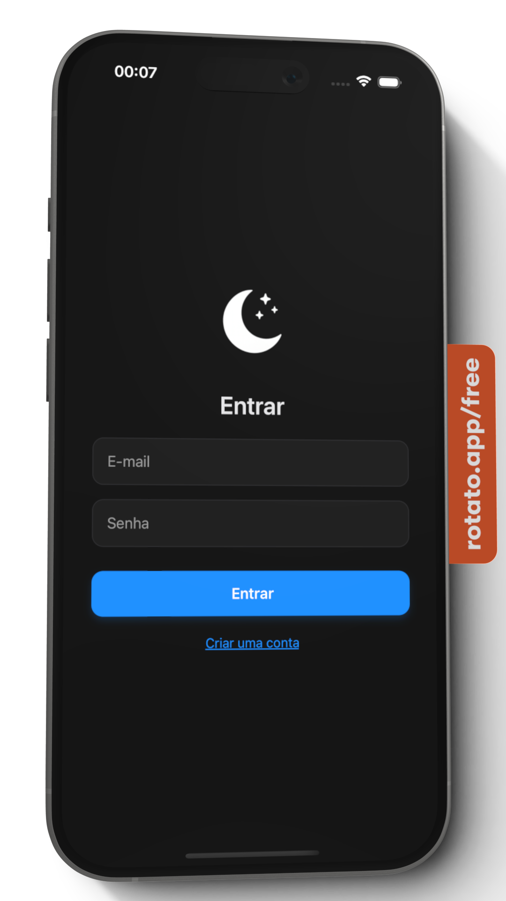
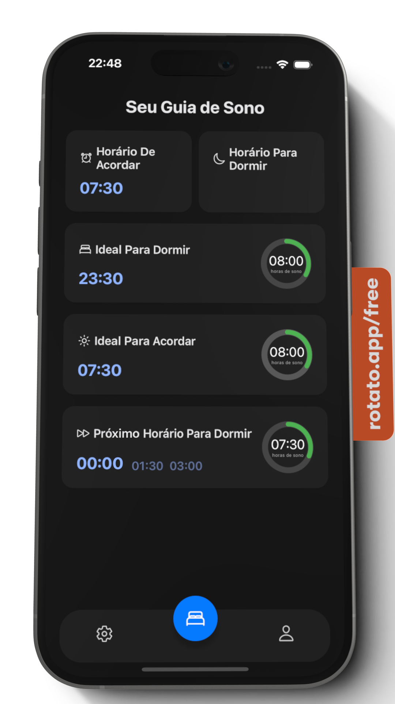
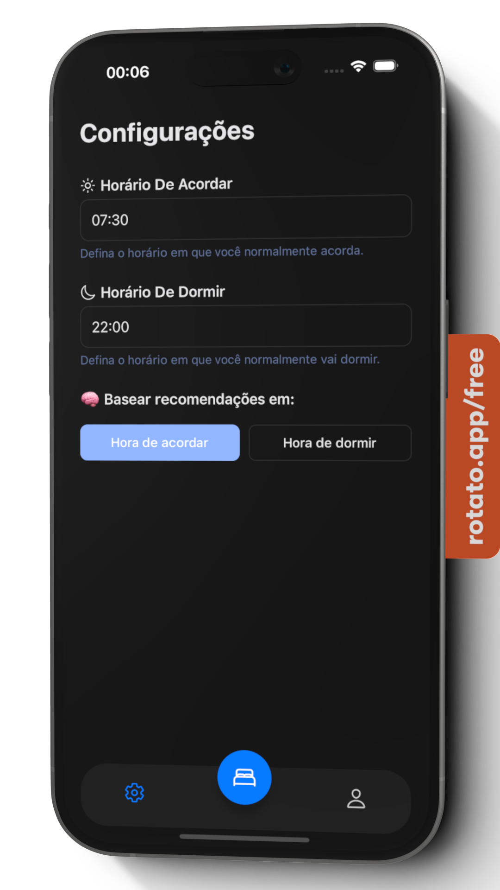
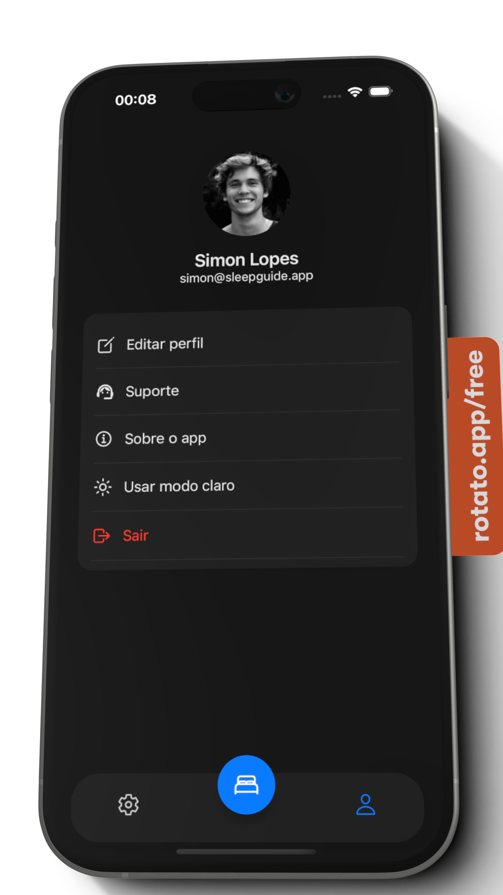
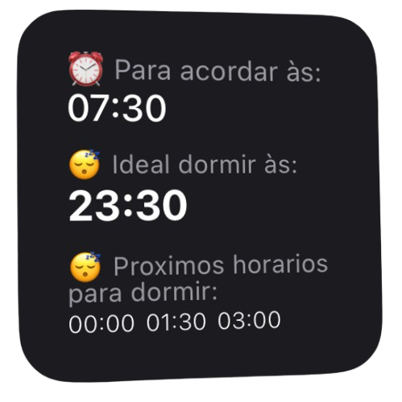

# 💤 SleepGuide

O **SleepGuide** é um aplicativo desenvolvido com **React Native** e **Swift** que ajuda você a melhorar sua rotina de sono, sugerindo horários ideais para dormir e acordar com base nos ciclos do sono.  
O app conta ainda com **widget para iOS** e integração com **Firebase** para autenticação e dados em nuvem.

### Apresentação


## ✨ Funcionalidades

- Cálculo inteligente dos horários ideais de sono
- Widget para consulta rápida na tela inicial (iOS)
- Interface leve e intuitiva
- Configurações personalizáveis
- Gerenciamento de conta com login e cadastro via Firebase

---

## 📱 Telas do app

### 🔐 Login



### 🏠 Home



### ⚙️ Configurações



### 👤 Conta



### 🧩 Widget



---

## 🛠️ Tecnologias utilizadas

- [React Native](https://reactnative.dev/)
- [Expo](https://expo.dev/)
- [Swift](https://developer.apple.com/swift/) – para criação do widget iOS
- [Firebase](https://firebase.google.com/) – autenticação e banco de dados
- [TypeScript](https://www.typescriptlang.org/)

---

## 🚀 Como rodar o projeto

```bash
# Clone o repositório
git clone https://github.com/seu-usuario/sleepguide.git

# Instale as dependências
cd sleepguide
npm install

# Inicie o projeto com Expo
npx expo start
```

> ⚠️ Para rodar o widget no iOS, é necessário abrir o projeto nativo no Xcode (ios/) e configurar o compartilhamento de dados entre o app e o widget com App Groups.

## 📄 Licença

Este projeto está sob a licença MIT.

## 🙋‍♂️ Autor

Desenvolvido com carinho por Simon Lopes.

[LinkedIn](https://www.linkedin.com/in/simon-lopes) • [GitHub](https://github.com/SimonLopes)
